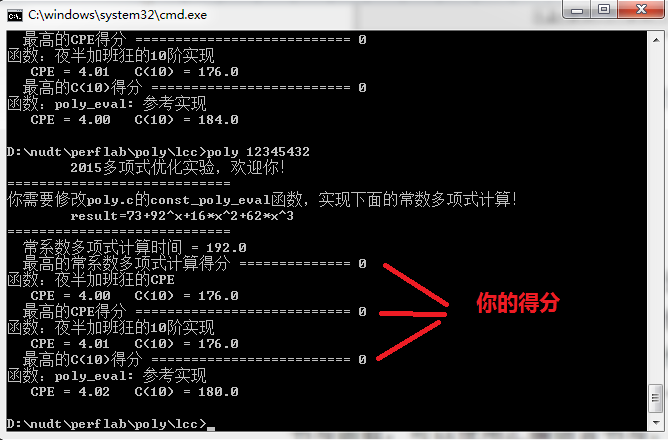
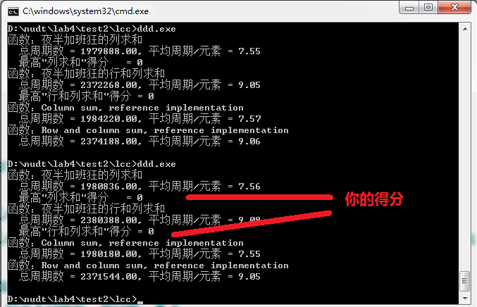

# 实验6、性能优化实验

> **注意！！** 如果发现评分波动较大，那是你的处理器在运行程序过程中自动降频所致。可以到BIOS设置中，关闭 SpeedStep 优化、低功耗优化、超线程优化等。

> **特别提醒：** 实验验收，是将你的 `poly.c` 和 `rowcol.c`，复制到**老爷机**上，在**老爷机**上编译、运行。以最后在**老爷机**上运行的得分为准。**并不是在你自己的机器上的得分！**

本实验，有两个主要任务。任务一，优化一个多项式计算函数，达到最高性能，主要是考查算术运算优化能力；任务二，优化一个矩阵求和函数，达到最高性能，主要考查存储器访问优化能力。所有评分，以运行时间为衡量，运行越迅速，得分越高。

---

## 任务一（多项式计算函数优化）

**原理提示：** 乘法运算是"昂贵而缓慢"的运算，加法/减法要快得多，移位运算也非常快。循环的优化，**请参考教材5.4、5.5、5.6、5.8、5.9**。

1. 首先不要修改任何文件，然后运行程序，程序会提示你，你需要实现的常系数多项式计算函数具体是什么，据此可以修改 `poly.c` 的 `const_poly_eval` 函数。

2. 请仔细阅读 `poly.c`，并对文件进行修改，书写自己的 `poly_eval`、`const_poly_eval` 函数实现，力争达到最大性能。你需要至少书写三个函数实现，一个用于计算常系数多项式，一个用于任意的高阶多项式计算，另一个用于固定的10阶多项式计算。书写函数，可以使用汇编语言书写。

3. 参考样例中的 `poly_eval` 函数，实现了下面的计算：

   `result = a[0]*x^0 + a[1]*x^1 + a[2]*x^2 + a[3]*x^3 + … + a[n]*x^n`

4. 利用修改好的 `poly.c`，生成可执行程序。程序会自动评分。

5. 生成可执行文件，运行可执行文件，程序将会给出自动评分。你的目标就是通过不断的优化 `const_poly_eval`、`poly_eval` 等函数使得评分尽可能高！

---

## 任务二（矩阵计算优化）

**原理提示：** 存储器访问是"非常昂贵而缓慢"的操作。地址连续的存储器访问，要远远快于地址分散的多次存储器访问。存储访问的优化，**请参考教材5.12、6.5、6.6**。

1. 请仔细阅读 `rowcol.c`，并对文件进行修改，书写自己的 `c_sum`、`rc_sum` 函数实现，力争达到最大性能。你需要至少书写两个函数实现，一个用于**计算矩阵中的每一列的和**（`c_sum`），另一个用于**计算矩阵中的每一行、每一列的和**（`rc_sum`）。书写函数，可以使用汇编语言书写。

2. 利用修改好的 `rowcol.c`，生成可执行程序。程序会自动评分。

3. 生成可执行文件，运行可执行文件，程序将会给出自动评分。你的目标就是通过不断的优化 `c_sum`、`rc_sum` 等函数使得评分尽可能高！

